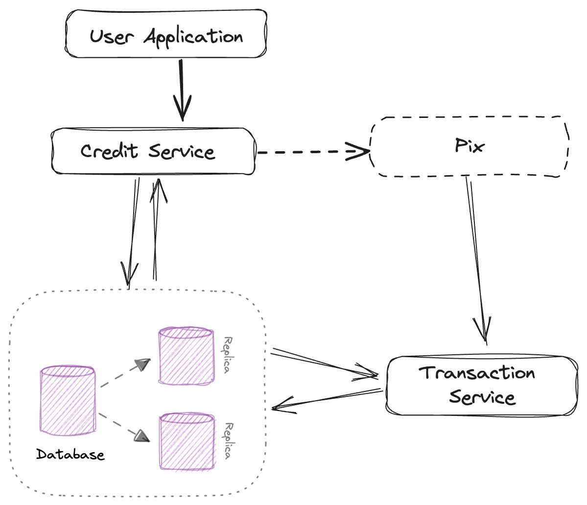

RFC: Credit System on Pix Infrastructure

This RFC seeks to present an initial solution for developing the credit system using PIX. In it, I describe the solution using several entities.

### Proposed Architecture

The architecture leverages existing Pix components, depicted in the attached Excalidraw mockup. Key elements include:

Credit Service: Manages credit requests, approvals, limits, and calculations.
Pix Network: Existing infrastructure for instant settlements.
User Application: User interface for applications, tracking, and repayments.
Database: Stores user data, credit details, and transaction history.

#### Database Schema (Enhanced with Relationships)

The relational database schema ensures data integrity and efficient querying:

*Users (Primary Entity):*
  - user_id (primary key)
  - name
  - cpf (unique)
  - phone_number (unique)
  - email

*Credit Accounts (Linked to Users):*
  - credit_account_id (primary key)
  - user_id (foreign key references Users.user_id)
  - credit_limit
  - available_credit
  - interest_rate

*Transactions (Linked to Credit Accounts):*
  - transaction_id (primary key)
  - credit_account_id (foreign key references Credit Accounts.credit_account_id)
  - transaction_amount
  - transaction_date
  - status (approved, pending, declined)

*Payments (Linked to Transactions):*
  - payment_id (primary key)
  - transaction_id (foreign key references Transactions.transaction_id)
  - payment_amount
  - payment_date
  - status (successful, failed)

#### Functionality

Imagine a user applying for credit through the intuitive User Application. The Credit Service assesses their eligibility and sets limits. Upon approval, a dedicated Credit Account is created.

- Seamless Credit Transactions: Users can initiate credit transactions directly within the User Application. The familiar Pix network facilitates instant settlements for these transactions. All transactions are securely stored.
- Flexible Repayments: Users can conveniently repay their credit through Pix transfers directly within the User Application. Each payment is linked to the corresponding transaction, automatically updating their available credit.

#### Future Enhancements

- Advanced Credit Scoring: Leverage AI for automated credit scoring and risk management.

- Diverse Credit Products: Offer flexible options like installment plans catering to different user needs.

### Conclusion (Strong Call to Action)

This enhanced credit system, built on Pix's robust infrastructure It offers convenient credit access and empowers users with greater financial flexibility. Let's leverage Pix's potential and create a user-centric solution.

